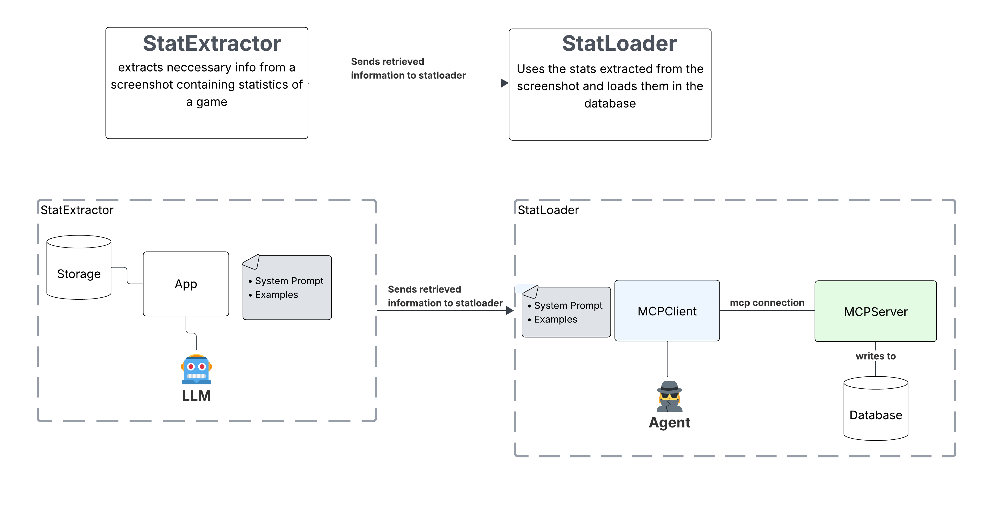

# Smart Stats

With smart stats you can extract game stats from screenshots, regardless of the game you are playing.

## How it works

SS uses vision enabled **LLMs** to extract text from images. SS uses LLMs instead of OCR, since the images will vary alot and the context of the image should be taken into account.

The information extracted from the image is then sent to an agent, that can understand the context of the game and store the  relevant stats in a database.

## Simple diagram



## oversimplified solution

The solution showcases the use of LLMs, agents & MCP to solve the problem. The functions do not actually store data in the database, but just print the data to the console. 
The image file is also handled locally and not in a cloud storage.

## Requirements

- uv: used to manage your python project
- ollama: can be used for local LLMs
- docker: to easily run the microservices & and an alpine image of ollama

## Running the project

you can run `./scripts.sh` to start the project. It will start the ollama docker container, install the dependencies and start the services.

```bash
./scripts.sh
```

also make sure ollama is up & running

the models SS uses are:

- qwen2.5vl:7b
- qwen3:0.6b

You can pull these models using the following commands:

```bash
ollama pull qwen2.5vl:7b
ollama pull qwen3:0.6b
```

You can then send a POST request to the stats service with an image file.

```bash
curl --location 'localhost:8000' \
--form 'file=@"./services/extractor/test_FN_stats.jpg"' \
--form 'username="Ben_Kim"'
```

Depending on the compute power of your machine, it can take a while to process the request.
